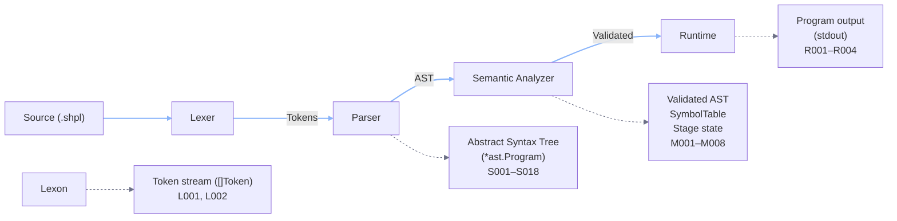
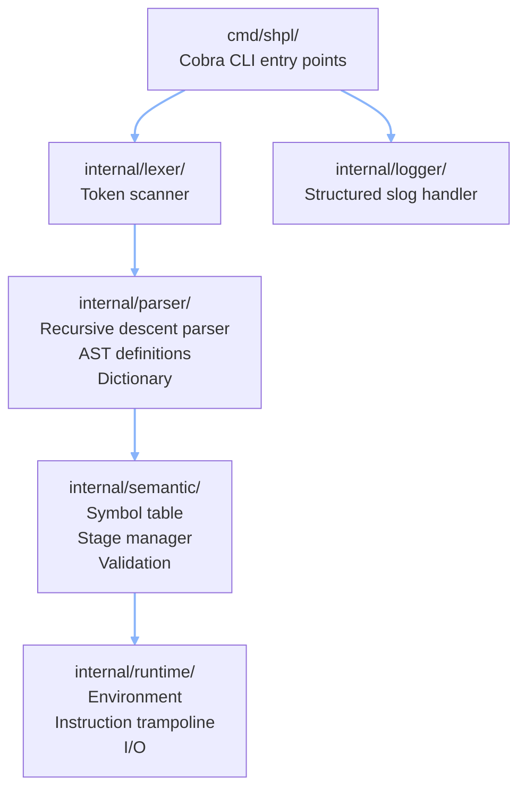

# Architecture Overview

The interpreter follows a four-stage pipeline: **Lexer → Parser → Semantic Analyzer → Runtime**.

## Package dependency graph

Dependencies flow downward only. No package imports from a higher layer.

## Key design decisions

- **Recursive descent parser** — one method per grammar production, no parser generator.
- **Type-switch dispatch** in semantic analyzer and runtime (no Visitor pattern — YAGNI).
- **Trampoline execution** — program flattened to `[]instr`, integer PC, no nested traversal.
- **Replay-based REPL** — full pipeline rerun on each submission (O(n²) at human scale).
