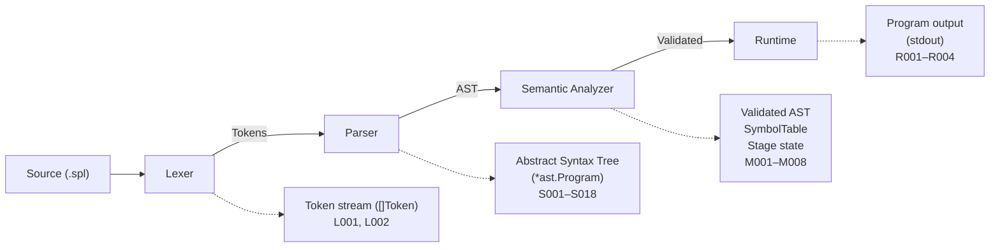

# Architecture Overview

The interpreter is a four-stage pipeline: **Lexer → Parser → Semantic Analyzer → Runtime**.

## Package dependency graph

Dependencies flow downward. No package imports from a higher layer.

## Key decisions

- **Recursive descent parser** — one method per grammar production, no parser generator.
- **Type-switch dispatch** in the semantic analyzer and runtime — no Visitor pattern.
- **Trampoline execution** — the program is flattened to `[]instr` with an integer PC.
- **Replay-based REPL** — reruns the full pipeline on each submission.
